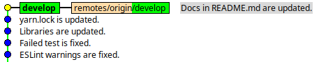
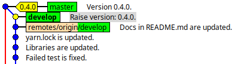
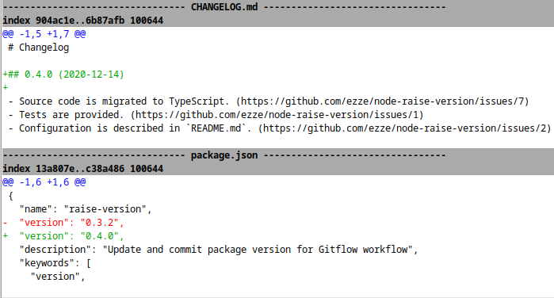

# node-raise-version

[](https://www.npmjs.com/package/raise-version)
[](https://circleci.com/gh/ezze/node-raise-version)
[](https://codecov.io/gh/ezze/node-raise-version)
[](https://www.npmjs.com/package/raise-version)
[](LICENSE.md)

Update and commit package version for Gitflow workflow.

## Why

This package makes bumping package version [according to semantic versioning](https://semver.org/) easier when using [Gitflow workflow](https://www.atlassian.com/git/tutorials/comparing-workflows/gitflow-workflow) just by running a single CLI command. It does the following things automatically:

- Bump version in `package.json` in development branch (say, make a patch update from `0.3.2` to `0.4.0`).
- Add release header with updated version and date in text changelog file:
  
   ```text
   ## 0.4.0 (2020-12-14)
   ```
  
- Commit changes in `package.json` and text changelog file with a message that looks like:
  
   ```
   Raise version: 0.4.0
   ```

- Merge changes to release branch and tag them as `0.4.0`.
- Push local development branch, release branch and new tags to remote repository.

All the things mentioned above are configurable. The package can also be used for [centralized workflow](https://www.atlassian.com/git/tutorials/comparing-workflows#centralized-workflow).

### Before



### After





## Installation

```
npm install raise-version --save-dev
```

or

```
yarn add raise-version --dev
```
   
## CLI usage

1. Initialize `raise-version` from the root directory of your project (optional — if missed then default configuration will be used):

   - if installed globally:

      ```
      raise-version init
      ```
            
   - if installed locally:
    
      ```
      npx raise-version init
      ```
      
   `.raiseverrc` configuration file will be created.
 
   `raisever` is an alias for `raise-version` CLI command.
    
2. Adjust configuration parameters in `.raiseverrc`, these are default values:

   ```json
   {
     "changelog": {
       "enabled": true,
       "path": "CHANGELOG.md",
       "encoding": "utf-8",
       "prefix": "##",
       "bullet": "-"
     },
     "git": {
       "enabled": true,
       "release": "master",
       "development": "develop",
       "remote": "origin",
       "commit": true,
       "merge": true,
       "all": false,
       "tag": true,
       "push": false
     }
   }
   ```

   They correspond to `options` of console command:

   - `-l`, `--changelog`           Update version in changelog file  [boolean] [default: true]
   - `-f`, `--changelog-path`      Path to changelog file  [string] [default: "CHANGELOG.md"]
   - `-e`, `--changelog-encoding`  Encoding of changelog file  [string] [default: "utf-8"]
   - `-h`, `--changelog-prefix`    Prefix for version header in changelog file  [string] [default: "##"]
   - `-b`, `--changelog-bullet`    Bullet character for changes' item in changelog file  [string] [default: "-"]
   - `-g`, `--git`                 Commit updates to git  [boolean] [default: true]
   - `-r`, `--git-release`         Git release branch  [string] [default: "master"]
   - `-d`, `--git-development`     Git development branch  [string] [default: "develop"]
   - `-o`, `--git-remote`          Git remote repository name  [string] [default: "origin"]
   - `-c`, `--git-commit`          Commit changes to development branch  [boolean] [default: true]
   - `-m`, `--git-merge`           Merge changes to release branch  [boolean] [default: true]
   - `-a`, `--git-all`             Commit all changes  [boolean] [default: false]
   - `-t`, `--git-tag`             Create git tag  [boolean] [default: true]
   - `-p`, `--git-push`            Push git changes to remote repository  [boolean] [default: false]
   
   More CLI options:

   `-s`, `--skip-update`           Don't update package.json file

   In order to use `raise-version` with centralized workflow just set a value of `development` branch equal to `release` branch (`master`). `git.merge` parameter and  `--git-merge` CLI option make no sense in this case.

3. Make changes to your source code, describe them in changelog file (if used) and raise a version:

   ```
   raise-version [release] [options]
   ```

   - `release` — semver part to update, one of the following: `major`, `minor`, `patch`;
   - `options` — CLI options overwriting configuration from `.raiseverrc`.

## Examples

Basic usage examples used below considers that `.raiseverrc` has default configuration (or not created):

- Update patch version in `package.json`, make new version and release date heading in `CHANGELOG.md` prepended with `##` (list items of changes are already prepended by `-`):

   ```
   raise-version patch
   ```

   ### Before
   
   *package.json*

   ```json
   {
     "name": "my-package",
     "vesion": "1.0.0"
   }
   ```

   *CHANGELOG.md*
   
   ```text
   # Changelog
  
   - New feature is implemented.
   - Some bugs are fixed.
   
   ## 1.0.0 (2020-12-07)
  
   - Initial release.
   ```
  
   ### After

   *package.json*
  
   ```json
   {
     "name": "my-package",
     "vesion": "1.0.1"
   }
   ```
  
   *CHANGELOG.md*

   ```text
   # Changelog
  
   ## 1.0.1 (2020-12-10)
  
   - New feature is implemented.
   - Some bugs are fixed.
   
   ## 1.0.0 (2020-12-07)
  
   - Initial release.
   ```
   
2. The same as previous but also push commits to remote repository:
    
   ```
   raise-version patch --git-push
   ```
   
3. Don't update version in `package.json` and `CHANGELOG.md`, don't commit but merge from `development` branch to `release` branch and push changes to remote repository:

   ```
   raise-version --skip-update --changelog=false --commit=false --git-push
   ```

4. Don't update, don't commit and don't merge anything, just push to remote repository only:

   ```
   raise-version --skip-update --changelog=false --commit=false --merge=false --git-push
   ```
    
## Programmatic usage

```javascript
const raiseVersion = require('raise-version');
raiseVersion({
  release: 'patch',
  git: {
    push: true
  }
}).catch(function(e) {
  console.error('Something went wrong');
});
```
